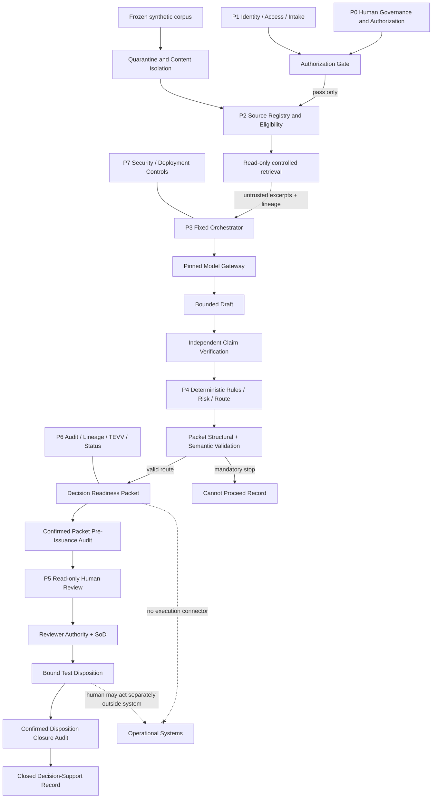

# Architecture

**Document version:** 1.0.0
**Environment:** `ISOLATED_PROTOTYPE_V1`

This document describes the architecture of the NABD AI Decision Review prototype as it is
implemented in this repository; it is not a design proposal, an operational runbook, or a
claim that the prototype is authorised for any institutional use.

---

## 1. What this system is, structurally

The prototype is one FastAPI service (`apps/api`) and one React single-page application
(`apps/web`) that may run together under Docker Compose alongside a PostgreSQL 16 database.
Logically it is a **modular monolith**: the boundaries between governance concerns are
explicit in the Python package layout, in the closed Pydantic schemas, in the role-based
dependencies, in the database grants, and in the test suite — but they are not network
boundaries, and V1 does not claim they are.

The single behaviour the whole structure exists to guarantee is narrow: a bounded question
about a frozen synthetic policy corpus is answered with exact citations, sealed into a
canonical JSON artefact, and handed to an authorised human. Nothing in the system performs,
approves, transmits or activates an institutional action, and no code path exists through
which it could.

---

## 2. Trust boundaries

### 2.1 Control plane and data plane

The central rule is that **no data-plane value may ever be written into a control-plane
field**. The two planes are separated by where their values come from, not by how they are
stored.

| Plane | Contains | Where it comes from | Enforcement |
|---|---|---|---|
| Control plane | Authorization fixtures, use-case contract, roles and identities, source eligibility metadata, the rule catalog, numeric limits, declared state transitions, schemas, version identifiers, model pinning | Build-controlled repository files under `data/fixtures/` and `data/synthetic_policy_collection_v1/`, plus frozen Python constants in `apps/api/app/domain/` | `app/services/fixtures.py` loads these read-only through closed Pydantic adapters; there is no write path. `app/config.py` deliberately excludes them from settings so that no deployment variable can widen them. |
| Data plane | The submitted question, retrieved excerpts, model input and output, generated claims, packet content, audit events, dispositions | Runtime requests, the corpus body text, model responses | Every data-plane value carries `TrustLabel.UNTRUSTED_CONTENT` or `DataClassification.SYNTHETIC_UNTRUSTED_CONTENT` (`app/domain/enums.py`) and is typed as `str`/`int` in closed models that have no field capable of expressing a route, a rule outcome, an authority claim or a state. |

Two concrete consequences are worth stating because they are the parts most often
implemented loosely elsewhere:

- **A model cannot name a control value.** `DraftResponse` and `VerificationResponse` in
  `app/schemas/model_io.py` are `extra="forbid"` models whose fields are claims, evidence
  identifiers, support states, quoted spans and free text. There is no `route`,
  `authorization`, `rule_outcome`, `state`, `tool` or `approved` field to populate, so a
  model asserting one produces a schema failure rather than an effect.
- **A client cannot name a control value.** `app/schemas/api.py` request models accept an
  identity id, one question string, and one disposition value with a rationale. Role,
  business scope, authority and separation-of-duties facts are derived server-side in
  `app/api/deps.py::current_identity` from the bearer token alone.

### 2.2 The boundaries in order of traversal

| # | Boundary | Crossing is checked by |
|---|---|---|
| B1 | Browser to API | `app/main.py::create_app.request_guard` (64 KiB body ceiling, correlation id), CORS restricted to `GET`/`POST`/`OPTIONS`, the security-header set including `Content-Security-Policy: default-src 'none'` |
| B2 | Anonymous to identified | `app/api/deps.py::current_identity` then `app/services/identity.py::resolve_session` (HMAC signature, stored token digest, expiry, fixture status) |
| B3 | Identified to role-permitted | `app/api/deps.py::require_role` producing `RequesterIdentity`, `ReviewerIdentity`, `AdminIdentity` |
| B4 | Role-permitted to case-visible | `app/api/deps.py::load_visible_case` (scope match, requester ownership, administrator exclusion; absent and invisible both return `NOT_FOUND`) |
| B5 | Request to authorised processing | `app/rules/catalog.py::auth_001` at stage 0, before any evidence or model access |
| B6 | Corpus to admitted evidence | `app/services/eligibility.py::evaluate_source_eligibility` then `app/services/retrieval.py::retrieve` |
| B7 | Admitted evidence to model | `app/services/prompts.py::build_draft_input` / `build_verification_input` (untrusted-content envelopes, input ceilings) and `app/services/model_gateway.py::ModelGateway._invoke` |
| B8 | Model output to governed data | `ModelGateway._screen_output`, `_parse`, and closed-schema validation in `ModelGateway.draft` / `verify` |
| B9 | Governed data to displayable packet | `app/services/packet.py::validate_packet_semantics` and `app/services/review.py::displayable_packet` |
| B10 | Packet to human disposition | `app/services/review.py::submit_disposition` with `app/rules/catalog.py::sod_001` |
| B11 | Anything to an operational system | No connector exists. `app/domain/prohibited.py` names what must be absent; `app/rules/catalog.py::path_001` fails closed at precedence 1 if an action endpoint is configured or attempted. |

---

## 3. Component map (P0–P7)

The diagram below mirrors Section 5 of the controlling specification. Each node is annotated
in the table that follows with the modules that implement it.



| Component | Implemented by | Notes |
|---|---|---|
| P0 Human governance and authorization | `data/fixtures/authorization.json`, `data/fixtures/use_case_contract.json`, `app/services/fixtures.py::primary_authorization`, `app/schemas/governance.py::AuthorizationDecision` | Build-controlled. The primary fixture carries `authorization_status: NOT_GRANTED` and a `fixture_notice` naming itself a test fixture. No route creates, edits or extends an authorization. |
| Authorization gate | `app/rules/catalog.py::auth_001`, `app/main.py::lifespan` | The startup check refuses to serve if the authorization fixture does not admit the current corpus manifest hash. |
| P1 Identity, access, intake | `app/services/identity.py`, `app/api/deps.py`, `app/api/routes_session.py`, `app/api/routes_cases.py::create_case`, `data/fixtures/identities.json` | Seven seeded identities; four are denial fixtures with `selectable_in_ui: false`. |
| Frozen synthetic corpus | `data/synthetic_policy_collection_v1/` (`manifest.json`, `sources/`, `conflicts.json`, `revocations.json`) | Seven source versions. See `docs/source-governance.md`. |
| Quarantine and content isolation | `app/domain/injection_patterns.py::scan_for_instruction_like`, `app/services/corpus.py::ParsedBlock.instruction_like_flags`, `app/rules/catalog.py::iso_001` | Fifteen deterministic patterns. Defence in depth, not a source-authority decision-maker. |
| P2 Source registry and eligibility | `app/services/eligibility.py::evaluate_source_eligibility`, `app/rules/catalog.py::src_001` | Hash, quarantine, lifecycle, scope, use case, access label and effective period, in that order. |
| Read-only controlled retrieval | `app/services/retrieval.py::retrieve` | Filters before ranking; `ts_rank_cd` on PostgreSQL, a portable integer scorer on SQLite. |
| P3 Fixed orchestrator | `app/services/orchestrator.py::CaseProcessor` | The only code that advances a case. Every advance goes through `assert_transition`. |
| Pinned model gateway | `app/services/model_gateway.py::ModelGateway`, `app/adapters/` | Two-call budget, one retry, timeout, output ceiling, marker scan, closed-schema parse. |
| P4 Deterministic rules, risk, route | `app/rules/framework.py`, `app/rules/catalog.py`, `app/services/packet.py::build_risk_profile` | Fifteen rules with explicit precedence. Dominant-factor risk. |
| Packet structural and semantic validation | `app/schemas/packet.py::DecisionReadinessPacket` (closed), `app/services/packet.py::validate_packet_semantics` | Twelve reportable semantic checks. |
| Decision Readiness Packet / stop record | `app/services/packet.py::build_packet`, `seal`; `app/schemas/packet.py::StopRecord` | A stop record is a distinct type and is never rendered as a packet. |
| Confirmed audits | `app/services/audit.py::record_and_confirm`, `app/rules/catalog.py::aud_001` | Commit, then re-read; failure to confirm means fail closed. |
| P5 Read-only human review | `app/services/review.py`, `app/api/routes_review.py`, `app/rules/catalog.py::sod_001` | Reviewer authority is re-verified at stages 16 and 17 independently. |
| P6 Audit, lineage, TEVV, status | `app/services/audit.py`, `app/api/routes_cases.py::read_lineage`, `app/services/tevv.py`, `app/api/routes_admin.py` | Four status dimensions are surfaced separately and never merged. |
| P7 Security and deployment controls | `app/domain/prohibited.py`, `app/main.py` middleware and headers, `app/rules/catalog.py::path_001`, `apps/api/alembic/versions/0002_append_only_audit.py` | Least-privilege grants and an append-only trigger are two independent controls over the same table. |
| Operational systems | Absent by design | The dashed edges in the diagram are the two facts the architecture must make true: the packet reaches no connector, and a human may act separately, outside this system, on their own authority. |

---

## 4. Modular-monolith structure

```text
apps/api/app/
├── main.py            # FastAPI app, middleware, single error envelope, health, startup self-check
├── config.py          # Non-secret runtime settings only; no control-plane value lives here
├── domain/            # Frozen vocabulary and pure logic. Imports nothing from services or api.
│   ├── enums.py            # Closed enumerations, the 20 ordered states, RISK_ORDER
│   ├── reason_codes.py     # The closed reason vocabulary and STATE_FAILURE_REASON
│   ├── limits.py           # Frozen numeric ceilings and LIMIT_REGISTER
│   ├── fsm.py              # DECLARED_TRANSITIONS, assert_transition, next_state
│   ├── canonical.py        # nabd-canonical-json-v1 profile, packet hashing
│   ├── notices.py          # The four fixed packet notices, verbatim
│   ├── prohibited.py       # The prohibited-connection inventory
│   ├── injection_patterns.py  # 15 deterministic instruction-like patterns
│   ├── versions.py         # Frozen component version identifiers
│   ├── errors.py           # Typed ControlError hierarchy with HTTP status mapping
│   └── ids.py              # Deterministic and random identifier construction
├── schemas/           # Closed Pydantic models (extra = forbid) for every boundary
├── rules/             # framework.py (context, registry, evaluation) + catalog.py (the 15 rules)
├── services/          # Orchestration and governance logic; the only layer that writes
├── adapters/          # protocol.py, mock_adapter.py, openai_compatible.py
├── repositories/      # tables.py (ORM) and database.py (engine, session scope)
├── api/               # deps.py and four routers; no business logic
└── prompts/           # draft_v1.md, verify_v1.md — versioned files, loaded verbatim
```

The dependency direction is one-way: `api` depends on `services`, which depend on `rules`,
`schemas` and `domain`; `domain` depends on nothing above it. This is what makes the rule
catalog testable as pure functions and the FSM testable without a database.

Two boundaries deserve naming because they are load-bearing:

- **`repositories/` is the only layer that knows SQL.** `app/services/retrieval.py` builds
  its query through SQLAlchemy expressions with bound parameters; the security suite asserts
  in `test_security.py::TestSqlAndRendering::test_no_string_formatted_sql_in_the_application`
  that no string-formatted SQL exists anywhere in the application.
- **`adapters/` return raw text, not parsed objects.** See the deviation recorded in
  section 8.4 below.

---

## 5. The ordered 20-state workflow

The states are defined in `app/domain/enums.py::CaseState`, indexed by
`CASE_STATE_STAGE`, and ordered by `ORDERED_CASE_STATES`. `CANNOT_PROCEED` is the
twenty-first value and has no stage; it and `CLOSED_DECISION_SUPPORT_RECORD` are the two
members of `TERMINAL_CASE_STATES`.

| Stage | State | Pass condition as implemented | Reason code on failure |
|---:|---|---|---|
| 0 | `AUTHORIZATION_PREFLIGHT` | `auth_001` accepts the fixture: current, admitted manifest hash, admitted contract, acting role in the authorized set | `AUTHORIZATION_NOT_CURRENT_OR_IN_SCOPE` |
| 1 | `ACTOR_AND_SESSION_VERIFICATION` | `id_001` accepts identity status, validity window and scope match | `REQUESTER_OR_SESSION_INVALID` |
| 2 | `REQUEST_NORMALIZATION` | `req_001` accepts one bounded question within length bounds with no multi-question marker | `REQUEST_CONTRACT_INVALID` |
| 3 | `USE_CASE_AND_RISK_SCOPE` | `scope_001` finds no excluded scope term | `USE_CASE_EXCLUDED_OR_UNBOUNDED` |
| 4 | `EVIDENCE_PLAN` | `evaluate_source_eligibility` yields at least one eligible source; the plan is capped at `SOURCE_PLAN_MAX` | `EVIDENCE_REQUIREMENT_UNRESOLVED` |
| 5 | `SOURCE_ELIGIBILITY` | `src_001` finds no hash mismatch, at least one eligible source, and every required authority class present; `iso_001` records quarantine exclusions | `SOURCE_ELIGIBILITY_FAILURE` |
| 6 | `READ_ONLY_RETRIEVAL_AND_ISOLATION` | `retrieve` returns at least one excerpt and `iso_001` finds no instruction-like flag in the admitted set | `RETRIEVAL_OR_ISOLATION_FAILURE` |
| 7 | `EVIDENCE_SUFFICIENCY` | `evd_001` finds excerpts present, no triggered declared conflict, and every required authority class represented among admitted excerpts | `EVIDENCE_INSUFFICIENT_OR_CONFLICTED` |
| 8 | `BOUNDED_DRAFT` | The single draft call returns schema-valid JSON citing only admitted excerpt ids | `MODEL_BOUNDARY_OR_SCHEMA_FAILURE` |
| 9 | `INDEPENDENT_VERIFICATION` | The single verifier call returns one verdict per drafted claim; `_bind_claims` re-slices every quote; `clm_001` finds no unsupported material claim, no citation outside the admitted set and no conflicted claim | `MATERIAL_CLAIM_UNSUPPORTED_OR_CONFLICTED` |
| 10 | `DETERMINISTIC_GOVERNANCE` | No applicable rule returned a mandatory stop, and no earlier recorded result is a mandatory stop | `DETERMINISTIC_GOVERNANCE_FAILURE` |
| 11 | `ROUTE_DETERMINATION` | The route is `HUMAN_REVIEW_REQUIRED`; it is assigned by code, never selected | `ROUTE_INVARIANT_FAILURE` |
| 12 | `PACKET_ASSEMBLY` | `build_packet` assembles and seals the canonical packet | `PACKET_ASSEMBLY_FAILURE` |
| 13 | `STRUCTURAL_AND_SEMANTIC_VALIDATION` | `validate_packet_semantics` returns an empty failure tuple and `pkt_001` passes | `PACKET_CONTRACT_FAILURE` |
| 14 | `PACKET_PRE_ISSUANCE_AUDIT` | `record_and_confirm` durably commits and re-reads the `PACKET_PRE_ISSUANCE` event, and `aud_001` sees its id | `CRITICAL_AUDIT_FAILURE` |
| 15 | `AWAITING_AUTHORIZED_HUMAN_REVIEW` | The packet is persisted `displayable=True`; processing ends here | See section 8.7 on expiry |
| 16 | `REVIEWER_AUTHORITY_AND_SOD` | `sod_001` accepts a reverified, active, correctly-roled, in-scope reviewer who is not the requester | `SEPARATION_OF_DUTIES_VIOLATION`, `REVIEWER_AUTHORITY_INVALID` or `ACCESS_DENIED`; the case returns to stage 15 |
| 17 | `DISPOSITION_BINDING` | `sod_001` passes again, a rationale of at least `RATIONALE_MIN_CHARS` is present, any supplied `packet_sha256` equals the issued hash, and no final disposition already exists | `DISPOSITION_RATIONALE_REQUIRED`, `PACKET_NOT_AVAILABLE` or `DISPOSITION_ALREADY_FINAL`; the case returns to stage 15 |
| 18 | `DISPOSITION_CLOSURE_AUDIT` | `record_and_confirm` commits a `DISPOSITION_CLOSURE` event, and `aud_001` confirms it is distinct from pre-issuance | `CRITICAL_AUDIT_FAILURE`; the case returns to stage 15 |
| 19 | `CLOSED_DECISION_SUPPORT_RECORD` | Reached only for a final disposition; `RETURN_FOR_CLARIFICATION` returns to stage 15 with the packet open | Terminal, no outbound edge |

`DECLARED_TRANSITIONS` holds 41 edges: the 19 sequential edges, one `CANNOT_PROCEED` edge
from each of the 19 stoppable states, and three declared return edges to
`AWAITING_AUTHORIZED_HUMAN_REVIEW` from stages 16, 17 and 18. Anything else — a skip, a
reorder, a self-loop, or any edge out of a terminal state — raises
`IllegalTransitionError` from `assert_transition`.

Two accuracy notes about the reason-code mapping: `STATE_FAILURE_REASON` in
`app/domain/reason_codes.py` covers stages 0 to 14 only. `failure_reason_for` returns
`DETERMINISTIC_GOVERNANCE_FAILURE` as the default for stages 15 to 19, because failures in
the review stages are reported through their specific rule reason codes rather than through
the state map.

---

## 6. Where each invariant is enforced

Each row names the code that would have to be changed or removed for the invariant to stop
holding. Where several controls act together, all are named, because none of them alone is
the enforcement point.

| Invariant | Enforced in |
|---|---|
| **INV-01** Human authority is non-delegable | `app/domain/enums.py::Route` admits only `HUMAN_REVIEW_REQUIRED` and `CANNOT_PROCEED`; `app/domain/enums.py::DispositionValue` admits only three test-only values; `app/services/orchestrator.py::CaseProcessor._run_stages` assigns the route in code at stage 11; `app/services/review.py::guard_no_execution` marks the terminal non-execution boundary; `app/domain/notices.py::HUMAN_AUTHORITY` states it in every packet; `app/services/packet.py::validate_packet_semantics` check `SEM-06` rejects any other route |
| **INV-02** Authorization precedes capability | `app/rules/catalog.py::auth_001` at precedence 2, evaluated in `AUTHORIZATION_PREFLIGHT` before any eligibility, retrieval or model work; `app/main.py::lifespan` refuses startup when the fixture does not admit the corpus manifest hash; `app/services/fixtures.py::primary_authorization` is read-only |
| **INV-03** Code controls the workflow | `app/domain/fsm.py::assert_transition` with `DECLARED_TRANSITIONS`, called from `app/services/orchestrator.py::CaseProcessor._transition_to` and `app/services/review.py::_record_transition`; `app/domain/fsm.py::next_state` supplies the successor; `app/rules/catalog.py::fsm_001` records the deterministic evidence that the entered state was reached through a declared edge; `app/schemas/model_io.py` has no field through which a model could name a state |
| **INV-04** Evidence precedes reasoning | `app/services/eligibility.py::evaluate_source_eligibility` (stages 4 and 5) and `app/services/retrieval.py::retrieve` (stage 6) both complete before the first model call at stage 8 in `CaseProcessor._run_stages`; `app/schemas/model_io.py::DraftRequest.excerpts` has `min_length=1`, so a draft request cannot be constructed without admitted evidence |
| **INV-05** All content is untrusted as instruction | `app/services/retrieval.py::retrieve` stamps `TrustLabel.UNTRUSTED_CONTENT` and `DataClassification.SYNTHETIC_UNTRUSTED_CONTENT` on every excerpt; `app/services/prompts.py::render_excerpt` wraps each excerpt in `UNTRUSTED_OPEN`/`UNTRUSTED_CLOSE`; `app/domain/injection_patterns.py::scan_for_instruction_like` flags instruction-like text; `app/services/model_gateway.py::ModelGateway._screen_output` rejects `PROHIBITED_OUTPUT_MARKERS`; `app/services/packet.py::_flatten_strings` with `PROHIBITED_PACKET_TERMS` rejects them in the packet |
| **INV-06** Deterministic rules outrank model output | `app/rules/framework.py::evaluate_state` runs every applicable rule without short-circuiting; `first_mandatory_stop` selects by `(precedence_rank, rule_id)`; `RuleRegistry.all` orders by precedence, so precedence is data rather than call order; `app/services/orchestrator.py::CaseProcessor._evaluate` acts on the returned stop regardless of model confidence, and raises `StopError` if a state has no applicable rule at all |
| **INV-07** Material claims require exact evidence | `app/services/orchestrator.py::CaseProcessor._bind_claims` re-slices every quoted span from the stored excerpt and downgrades `SUPPORTED` to `UNSUPPORTED` when a quote does not reproduce; `app/rules/catalog.py::clm_001` stops on unsupported material claims, fabricated citations and conflicted claims; `app/services/packet.py::validate_packet_semantics` checks `SEM-02`, `SEM-03` |
| **INV-08** Uncertainty is visible | `app/services/orchestrator.py::CaseProcessor._record_uncertainty` writes `UncertaintyRecord` rows for triggered conflicts and quarantine exclusions; `app/services/packet.py::build_risk_profile` turns them into a risk factor; `app/schemas/packet.py::DecisionReadinessPacket` carries `uncertainty`, `conflicts` and `risk` as first-class packet sections, and `StopRecord` carries the same uncertainty on the stop path |
| **INV-09** Failure is closed and typed | `app/domain/errors.py::ControlError` and its subclasses; `app/domain/reason_codes.py::ReasonCode` is the closed vocabulary; `app/services/orchestrator.py::CaseProcessor.run` converts any `ControlError` into `_stop`; `app/main.py::create_app.unhandled_handler` renders an unexpected exception as `INTERNAL_CONTROL_FAILURE` with no detail |
| **INV-10** The packet is the governed artefact | `app/domain/canonical.py::canonical_dumps` and `compute_packet_hash` define the preimage; `app/services/packet.py::build_packet` and `seal` produce it; `app/api/routes_cases.py::read_packet` returns the canonical payload with `seal_verified` recomputed by `verify_packet_hash`; the free-text `draft_summary` is a subordinate field of the claim ledger, not the answer |
| **INV-11** Review is an authority process | `app/services/review.py::submit_disposition` re-derives authority through `_authority_context` at stages 16 and 17 separately; `app/rules/catalog.py::sod_001`; `app/api/deps.py::require_role` gates the route to `ReviewerIdentity`; `app/services/review.py::review_queue` applies separation of duties to the queue as well as to the action |
| **INV-12** Review never unlocks execution | `app/services/review.py` performs only database writes and audit appends; `guard_no_execution` exists as an explicit, testable marker at that boundary; `app/domain/prohibited.py::PROHIBITED_INTEGRATIONS` names the ten categories that must be absent; `app/rules/catalog.py::path_001` fails closed at precedence 1; `app/services/packet.py::PROHIBITED_PACKET_TERMS` keeps action targets out of the artefact |
| **INV-13** Critical audit precedes release and closure | `app/services/audit.py::record_and_confirm` commits and then re-reads, raising if the event is not durable; `app/rules/catalog.py::aud_001` requires a confirmed pre-issuance event at stage 14 and a distinct confirmed closure event at stage 18; `app/services/review.py::displayable_packet` re-checks the confirmed event's binding against the packet id, version and issued hash rather than trusting the stored `displayable` flag; `validate_packet_semantics` checks `SEM-09`, `SEM-10` |
| **INV-14** Status has four dimensions | `app/schemas/packet.py::PacketStatusBlock` carries `built`, `integration`, `operational` and `authorization` as four separate fields; `app/api/routes_admin.py::read_configuration` returns the same four values separately; `app/domain/enums.py` gives each dimension its own enumeration so they cannot be collapsed into one type |
| **INV-15** Deployment does not change authority | `app/config.py::Settings._live_mode_requires_full_pinning` demands explicit pinning and a single `https://` endpoint before live mode loads; `app/adapters/openai_compatible.py::OpenAICompatibleAdapter.__init__` refuses to construct outside live mode and re-validates the URL; `app/services/model_gateway.py::ModelGateway._assert_adapter_boundaries` refuses any adapter advertising tools or fallback; the route set, rule catalog and limits are `domain` constants that no mode or deployment variable reaches |
| **INV-16** No self-certification | `data/fixtures/model_configurations.json` and `data/fixtures/authorization.json` pin all four status values to `NOT_EVIDENCED`/`NOT_GRANTED`; `app/schemas/model_io.py::ModelConfiguration` defaults them to the same; `app/api/routes_admin.py::read_configuration` returns a fixed status block that no request can change; no route accepts a status claim, and acceptance exists only as the human-owner record template in `artifacts/templates/human_owner_acceptance_record.md` |

---

## 7. Request lifecycle, end to end

The following describes one benign case from session creation to a closed record, naming
every artefact written along the way.

**Session.** `POST /api/v1/demo/session` reaches
`app/services/identity.py::create_session`, which refuses any identity that is not seeded,
not `selectable_in_ui` or not `ACTIVE` — with one indistinguishable error for all three, so
probing reveals nothing. A `DemoSessionRow` stores only the SHA-256 of the issued token; the
token itself is `session_id.nonce.hmac` and is never persisted.

**Intake.** `POST /api/v1/cases` requires `RequesterIdentity`. It refuses immediately if the
kill switch is active, then `app/services/orchestrator.py::build_case_row` normalises the
question (NFC, collapsed whitespace) and records `question_sha256`. The case starts at
`AUTHORIZATION_PREFLIGHT` and a `CASE_CREATED` audit event is appended whose
`payload_reference` carries the question digest, not the question.

**Processing.** `POST /api/v1/cases/{id}/process` refuses unless the case is still at stage
0 — a replay attempt raises `IllegalTransitionError` and returns HTTP 409. `CaseProcessor.run`
then walks stages 0 to 15. At each stage it calls `_transition_to`, which asserts the edge,
writes a `CaseStateTransitionRow` carrying the component versions and applicable rule
versions, appends a `STATE_TRANSITION` audit event, and only then updates
`CaseRow.current_state`. `_evaluate` builds a fresh `RuleContext` and runs every applicable
rule; results are persisted as `DeterministicResultRow` and each failure raises a
`DETERMINISTIC_RULE_RESULT` audit event, escalated to `S0_CRITICAL` when the reason is
`PROHIBITED_ACTION_PATH_DETECTED`.

Stages 4 to 7 produce the evidence: eligibility decisions, then `EvidenceExcerptRow` rows
with page, section, block index and exact character offsets, then conflict detection against
`conflicts.json` and any `UncertaintyRecordRow`. Stage 8 makes the single draft call; stage 9
makes the single verifier call and then `_bind_claims` re-slices each quoted span from the
stored excerpt, writing `GeneratedClaimRow` and `ClaimEvidenceLinkRow` with a
`quote_verified` boolean per link.

**Packet.** Stage 12 generates the pre-issuance audit event id **first**, then assembles and
seals the packet so that the packet carries that reference inside its own preimage. Stage 13
runs `validate_packet_semantics` against a `SemanticContext` gathered independently of the
packet. Stage 14 writes the event under exactly that id through `record_and_confirm`, which
commits and re-reads it; only then is the packet persisted with `displayable=True`,
`packet_sha256` and `issued_sha256` both set to the sealed hash.

**Review.** `GET /api/v1/cases/{id}/packet` calls `displayable_packet`, which locates the
confirmed `PACKET_PRE_ISSUANCE` event and compares its binding to the packet id, version and
`issued_sha256`; a mismatch is `CRITICAL_AUDIT_FAILURE` rather than a degraded display. A
`PACKET_VIEWED` event is appended. `POST /api/v1/cases/{id}/dispositions` requires
`ReviewerIdentity`, appends `REVIEW_ATTEMPT`, and then runs stages 16 to 19 with the
authority context rebuilt separately at each stage. On a final disposition the packet is
resealed with the closure binding, revalidated, and the case transitions to
`CLOSED_DECISION_SUPPORT_RECORD`; `issued_sha256` is deliberately left untouched.

**Failure at any point.** `CaseProcessor._stop` writes a `StopRecord` into
`CaseRow.stop_record`, transitions to `CANNOT_PROCEED`, and returns. No packet row is
persisted, so `GET .../packet` returns `PACKET_NOT_AVAILABLE`. The reason code is one member
of the closed `ReasonCode` vocabulary and its message is the fixed, non-leaking text from
`REASON_MESSAGES`.

---

## 8. Stack substitutions and deviations

Each entry records what the code does, how it differs from the controlling specification,
and why. None of these is documented as an aspiration: every statement below describes code
that exists in this repository.

### 8.1 The frozen corpus is authored as normalised UTF-8 text, not as committed PDFs

Specification Section 6 nominates PyMuPDF for "synthetic PDF parsing during seeding only",
which implies committed binary PDF sources. The corpus is instead authored as normalised
UTF-8 text files under `data/synthetic_policy_collection_v1/sources/`, using explicit
`<<<PAGE n>>>` markers for page boundaries and `## ` prefixes for section headings.
`app/services/corpus.py::parse_source_text` parses that format and, before returning,
asserts for every block that `raw_text[char_start:char_end] == block.text`.

The reason is reproducibility and reviewability. Character offsets are the unit of proof for
every citation in this system: a claim is supported only because a quoted span can be
re-sliced at exact offsets from a stored excerpt. Binary PDF text extraction is sensitive to
the extractor version, its layout heuristics and its whitespace handling, so offsets derived
from a PDF are stable only as long as the toolchain is. An authored text file makes the
offsets a property of the committed bytes, and it makes a change to a source visible as a
readable diff in review rather than as an opaque binary change. `parse_source_text` refuses
input that is not already NFC-normalised with `\n` line endings, precisely so that no
normalisation step can silently shift an offset.

PyMuPDF is still used, and still only during seeding.
`scripts/seed_synthetic_corpus.py::render_pdf_facsimile` renders a derived read-only PDF
facsimile of each source into `artifacts/derived_pdf/` and returns its page count; the seed
then compares that count against the parsed page structure and fails closed on disagreement.
The facsimile is a convenience artefact for human reading. The authored text file remains the
hashed source of truth, and neither path introduces a runtime upload or ingestion route.

### 8.2 Control-plane fixtures live in `data/fixtures/`

The specification's repository shape in Section 6 shows the corpus directory but does not
show a separate fixtures directory. In this implementation the frozen corpus lives in
`data/synthetic_policy_collection_v1/` (manifest, sources, conflicts, revocations, TEVV
matrix) and the four control-plane fixture files live alongside it in `data/fixtures/`:
`authorization.json`, `use_case_contract.json`, `identities.json` and
`model_configurations.json`.

The separation is deliberate. The corpus directory is the thing whose hash the authorization
fixture admits, and `manifest.json` computes a self-hash over its own content; mixing
authorization and identity fixtures into that directory would make the manifest hash depend
on values that are not corpus content. `app/config.py` exposes `CORPUS_DIR` as an overridable
setting so tests can point the loader at a temporary corpus, whereas `FIXTURES_DIR` in
`app/services/fixtures.py` is anchored to the repository root and is not overridable — which
is the correct asymmetry, because a deployment must not be able to substitute its own
authorization fixture.

One related absence should be stated plainly: the specification's repository shape lists
`data/synthetic_policy_collection_v1/expected_excerpts.json`, and that file does not exist.
Its role is served by two things that do exist — `extracted_text_sha256` and `block_count`
per source version in `manifest.json`, which the seed verifies against the parsed document,
and the per-scenario `assertions` arrays in `test_cases.json`, which pin expected admitted
and cited source sets directly.

### 8.3 A packet carries its own pre-issuance audit reference, and the issued hash is retained separately

Specification Section 12.1, checks 9 and 10, require that packet display and any final
disposition bind a confirmed audit event whose packet id, version and hash match exactly.
Implementing that literally creates a circular dependency: the audit event binds the packet
hash, and the packet's `audit_binding.pre_issuance_event_id` is part of the sealed preimage,
so each value would have to exist before the other.

The implementation breaks the cycle by ordering, not by weakening either side. At stage 12
`CaseProcessor._run_stages` generates the event id with `new_id("event")` **before** sealing,
so the packet's preimage already contains its own audit reference. At stage 14 the event is
written under exactly that id — `app/services/audit.py::build_event` accepts an `event_id`
argument for this purpose — binding the resulting `packet_sha256`. The two therefore never
disagree, and a packet displayed without its confirmed pre-issuance event would not match
its own recorded hash.

A second consequence follows. Attaching a final disposition reseals the packet:
`app/services/review.py::submit_disposition` calls
`app/services/packet.py::with_audit_binding`, which adds the closure binding and the
disposition and recomputes the hash. The packet's current hash therefore changes after
review, while the hash that the pre-issuance event bound — and that the reviewer actually
disposed of — must not. Migration `apps/api/alembic/versions/0004_packet_issued_hash.py`
adds `decision_packets.issued_sha256` to retain it, backfilling existing rows from
`packet_sha256`. `displayable_packet` compares the audit binding against
`issued_sha256 or packet_sha256`; `submit_disposition` binds `issued_sha256` into the
`HumanDisposition`; and `SemanticContext.issued_packet_sha256` carries it into check
`SEM-10`. After closure, `packet_row.packet_sha256` is updated to the resealed value and
`issued_sha256` is left untouched, which is asserted by
`test_pipeline.py::TestReviewAndDisposition::test_disposition_binds_the_exact_issued_hash`.

### 8.4 The adapter protocol returns raw text rather than parsed response objects

Specification Section 10 defines the adapter protocol as
`draft(request: DraftRequest) -> DraftResponse` and
`verify(request: VerificationRequest) -> VerificationResponse`. In this implementation
`app/adapters/protocol.py::ModelAdapter` returns `RawModelResponse` — untyped text, a
duration and the model revision that answered — and `app/services/model_gateway.py` owns the
size ceiling, the prohibited-marker scan, the JSON parse, the refusal check and the
closed-schema validation.

The reason is that a protocol typed to return `DraftResponse` puts the schema guarantee in
the adapter, where an adapter author could satisfy the type signature by coercing a
malformed answer into a valid object. Returning raw text makes it structurally impossible for
an adapter to assert schema validity: the only code that can produce a `DraftResponse` is
`ModelGateway.draft`, which does so through `DraftResponse.model_validate` and records a
failed `ModelRunRecord` when validation fails. The gateway is also where the marker scan and
the model-revision check belong, since both must apply identically to the mock adapter and
to the optional live adapter.

### 8.5 The mounted API surface is larger than Section 13 by three read-only endpoints

`contracts/openapi.json` mounts 22 paths and 23 operations. Section 13 of the specification
tabulates 20. The three additional operations are all read-only `GET` endpoints that exist to
serve the UI routes required by Section 14.1:

| Endpoint | Serves | Role |
|---|---|---|
| `GET /api/v1/demo/identities` | `/login` identity selection | Unauthenticated; returns only `selectable_in_ui` profiles, so the four denial fixtures are not offered |
| `GET /api/v1/cases/{case_id}/progress` | `/cases/:id/progress` | Case-visible identity; returns the transition timeline, rule results, the limit register and any stop record |
| `GET /api/v1/review/queue` | `/review` | `ReviewerIdentity`; separation of duties is applied to the queue itself |

No endpoint outside Section 13 mutates anything, and the full inventory is documented in
`docs/api-contract.md`.

### 8.6 Semantic validation implements twelve reportable checks, not eleven

Section 12.1 lists eleven semantic invariants. `validate_packet_semantics` implements all
eleven and adds `SEM-12_SEAL_DOES_NOT_VERIFY`, which recomputes the canonical hash over the
packet's own preimage and compares it to `integrity.packet_sha256`. It also strengthens
check 7: a `HUMAN_REVIEW_REQUIRED` packet whose `risk.inherent_risk` is `CRITICAL` is
reported as `SEM-07_CRITICAL_RISK_WITHOUT_STOP`, so a critical dominant risk factor cannot
coexist with a review route.

### 8.7 Boundaries that are declared but not exercised in V1

Three things are visible in the control plane without a runtime path, and it is more useful
to say so than to leave a reader to infer that they are active:

- **Packet export rate limiting.** `PACKET_EXPORT_MIN_INTERVAL_SECONDS` and
  `EXPORT_RATE_LIMIT_EXCEEDED` are registered in `app/domain/limits.py`, and the limit
  register is surfaced by the admin configuration endpoint. No export endpoint is mounted, so
  the reason code is currently unreachable through the API.
- **Waiting-state expiry.** Specification Section 11.2 stage 15 says "wait/expire as
  configured". No expiry timer is implemented; a case at `AWAITING_AUTHORIZED_HUMAN_REVIEW`
  waits indefinitely.
- **`guard_no_execution`.** `app/services/review.py::guard_no_execution` is defined and is
  called by no production code path, because there is no connector to guard. Its docstring
  states this explicitly. It exists so that the boundary is a named, testable location rather
  than an implicit absence.

---

## 9. Related documents

| Document | Covers |
|---|---|
| `docs/api-contract.md` | Every mounted endpoint, the single error envelope, the absent methods |
| `docs/rule-catalog.md` | The 15 rules, precedence semantics, dominant-factor risk, the ordered state table |
| `docs/source-governance.md` | The frozen corpus, manifest hashing, retrieval contract, conflict and revocation registries |
| `docs/model-configuration-card.md` | The two pinned configurations, the two-call budget, failure modes, live-mode constraints |
| `docs/threat-model.md` | Assets, actors, threats, controls, code locations, tests, residual risk |
| `docs/tevv-plan.md` | The 31 frozen scenarios, acceptance targets, coverage gaps |
| `SECURITY_BOUNDARIES.md` | The prohibited-connection inventory as a reviewable list |
| `PROTOTYPE_STATUS.md` | Component versions and the four status dimensions |

---

| Dimension | Value |
|---|---|
| Built | `NOT_EVIDENCED` |
| Integration | `NOT_EVIDENCED` |
| Operational | `NOT_EVIDENCED` |
| Authorization | `NOT_GRANTED` |
