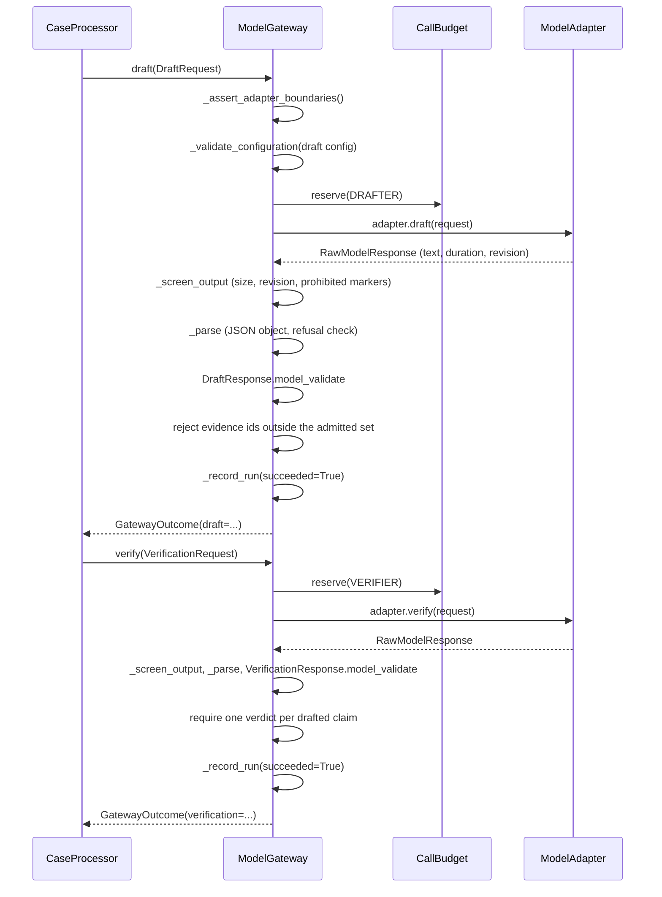

# Model Configuration Card

**Document version:** 1.0.0
**Environment:** `ISOLATED_PROTOTYPE_V1`

This document is the reference configuration card for the two pinned model configurations
this prototype uses, the call budget and failure modes that bound them, and the constraints
on the optional live mode; it is not an evaluation report, and no live-model evaluation has
been run in this build.

---

## 1. What is pinned, and where

`data/fixtures/model_configurations.json` is a build-controlled fixture, not a setting. Its
notice states the governing rule: exactly one pinned configuration is active per task role
per run, a change to any material field must create a new configuration id, and there is no
runtime switching, no provider fallback and no model discovery.

| Field | Value |
|---|---|
| `fixture_set_version` | `1.0.0` |
| `active_draft_configuration_id` | `MC-MOCK-DRAFTER-V1` |
| `active_verifier_configuration_id` | `MC-MOCK-VERIFIER-V1` |

The fixture is loaded read-only by `apps/api/app/services/fixtures.py::load_model_configurations`
through the closed Pydantic model `apps/api/app/schemas/model_io.py::ModelConfiguration`
(`extra = forbid`), and resolved per task role by `active_model_configuration`, which raises
`FixtureError` if a named active id is not defined. There is no route that creates, edits,
replaces or removes a configuration — see `docs/api-contract.md` section 1.2.

---

## 2. Configuration card: `MC-MOCK-DRAFTER-V1`

| Field | Value |
|---|---|
| Configuration id | `MC-MOCK-DRAFTER-V1` |
| Schema version | `nabd-schema-v1` |
| Produced by | `build:data/fixtures/model_configurations.json` |
| Provider / runtime | in-process deterministic mock adapter |
| Model revision | `deterministic-mock-1.0.0` |
| Endpoint or artifact hash | `local:DeterministicMockAdapter` |
| Task role | `DRAFTER` |
| Prompt version | `prompt-draft-v1.0.0` (`apps/api/app/prompts/draft_v1.md`) |
| Output JSON Schema | `draft-response-v1` (`contracts/jsonschema/draft-response-v1.json`) |
| Temperature | `temperature_milli = 0` (that is, 0.000) |
| Top-p | `top_p_milli = 1000` (that is, 1.000) |
| Seed | `0` |
| Context limit | 10,000 characters |
| Output limit | 6,000 characters |
| Per-call timeout | 20 seconds |
| Maximum same-endpoint retries | 1 |
| Tool calling | `false` (typed `Literal[False]`) |
| Fallback | `false` (typed `Literal[False]`) |
| Data-handling note | "Runs in process. No network egress, no persistence outside the local demo database, no telemetry." |
| Evaluation version | `tevv-plan-v1.0.0` |
| Effective from | 2025-01-01T00:00:00.000Z |
| Effective to | *(none)* |
| Revoked | `false` |
| Mode | `mock` |
| Built | `NOT_EVIDENCED` |
| Integration | `NOT_EVIDENCED` |
| Operational | `NOT_EVIDENCED` |
| Authorization | `NOT_GRANTED` |

## 3. Configuration card: `MC-MOCK-VERIFIER-V1`

| Field | Value |
|---|---|
| Configuration id | `MC-MOCK-VERIFIER-V1` |
| Schema version | `nabd-schema-v1` |
| Produced by | `build:data/fixtures/model_configurations.json` |
| Provider / runtime | in-process deterministic mock adapter |
| Model revision | `deterministic-mock-1.0.0` |
| Endpoint or artifact hash | `local:DeterministicMockAdapter` |
| Task role | `VERIFIER` |
| Prompt version | `prompt-verify-v1.0.0` (`apps/api/app/prompts/verify_v1.md`) |
| Output JSON Schema | `verification-response-v1` (`contracts/jsonschema/verification-response-v1.json`) |
| Temperature | `temperature_milli = 0` |
| Top-p | `top_p_milli = 1000` |
| Seed | `0` |
| Context limit | 12,000 characters |
| Output limit | 6,000 characters |
| Per-call timeout | 20 seconds |
| Maximum same-endpoint retries | 1 |
| Tool calling | `false` |
| Fallback | `false` |
| Data-handling note | "Runs in process. No network egress, no persistence outside the local demo database, no telemetry." |
| Evaluation version | `tevv-plan-v1.0.0` |
| Effective from | 2025-01-01T00:00:00.000Z |
| Effective to | *(none)* |
| Revoked | `false` |
| Mode | `mock` |
| Built | `NOT_EVIDENCED` |
| Integration | `NOT_EVIDENCED` |
| Operational | `NOT_EVIDENCED` |
| Authorization | `NOT_GRANTED` |

### 3.1 Notes on the field values

**The two configurations differ in exactly three fields.** Task role, prompt version, output
schema id and context limit. Everything else — revision, sampling, output ceiling, timeout,
retry budget, data handling, evaluation version, effective period, mode, status — is
identical. That the drafter and verifier share one runtime is a property of the mock mode; it
does not make them one call, because the budget accounts for them separately (section 4) and
the gateway selects the configuration per role in `ModelGateway._configuration`.

**Sampling parameters are integers on purpose.** `temperature_milli` and `top_p_milli` are
thousandths, constrained by the schema to `0 ≤ temperature_milli ≤ 2000` and
`0 ≤ top_p_milli ≤ 1000`. The canonical JSON profile in `apps/api/app/domain/canonical.py`
rejects floating-point values outright, so a temperature stored as `0.0` could not appear in
a hashed artefact. Storing thousandths keeps the value exact and hashable.
`apps/api/app/adapters/openai_compatible.py::OpenAICompatibleAdapter._call` divides by 1000
at the wire boundary, which is the only place the value becomes a float.

**Tool calling and fallback are typed, not merely set.** In `ModelConfiguration` both are
`Literal[False]`. A fixture that set either to `true` would fail schema validation at load
time — the configuration could not be constructed, let alone used. This is stronger than a
runtime check because it removes the representable state.

**The verifier's context limit is larger than the drafter's** (12,000 versus 10,000
characters), matching `VERIFIER_INPUT_MAX_CHARS` and `DRAFT_INPUT_MAX_CHARS` in
`apps/api/app/domain/limits.py`. The verifier receives the drafted claims *plus* the same
admitted excerpts, so its input is strictly larger than the drafter's for the same case.

**Output limits are doubly bounded.** The schema constrains `output_limit_chars` to at most
`MODEL_OUTPUT_MAX_CHARS`, and `ModelGateway._screen_output` enforces
`min(configuration.output_limit_chars, MODEL_OUTPUT_MAX_CHARS)`. A fixture cannot raise the
ceiling, and lowering it takes effect. The same double-bounding applies to `timeout_seconds`
(at most `PER_CALL_TIMEOUT_SECONDS` = 20) and `max_same_endpoint_retries` (at most
`SAME_ENDPOINT_RETRY_MAX` = 1).

**The four status values are pinned in three independent places.** The fixture sets them; the
Pydantic model defaults them to the same values; and `apps/api/app/api/routes_admin.py::read_configuration`
returns its own fixed status block. No request can change any of them, and no acceptance
mechanism exists outside the human-owner record template at
`artifacts/templates/human_owner_acceptance_record.md`. This is INV-16, asserted by
`test_contracts.py::TestEnumerations::test_status_dimensions_default_to_unevidenced`.

### 3.2 What the mock adapter actually does

The default adapter is `apps/api/app/adapters/mock_adapter.py::DeterministicMockAdapter`, and
its behaviour matters for reading any TEVV result, so it is worth stating precisely. It is
not a stub returning a canned answer.

For a draft, it extracts question terms with `apps/api/app/services/retrieval.py::question_terms`,
computes integer inverse-document-frequency weights across the admitted excerpts
(`term_weights`), scores every sentence of every excerpt by weighted distinct-term overlap
plus a section-heading bonus (`_sentence_score`), and selects up to `MAX_CLAIMS` (4) sentences
globally ordered by `(-score, excerpt.rank, offset)` with at most two per excerpt
(`select_claim_sentences`). Each claim statement **is** that exact sentence, so the verifier
can locate it at exact character offsets. The first `MATERIAL_CLAIM_COUNT` (2) claims are
labelled `MATERIAL`; the rest are `NON_MATERIAL`.

For a verification, it looks up each claim's cited excerpt and checks
`claim.statement in excerpt.text`. If present, it returns `SUPPORTED` with a support span at
the located offsets; if absent, `UNSUPPORTED` with an explanatory note.

Two consequences follow. First, the citation-accuracy checks are meaningful rather than
tautological: the drafter quotes real corpus text, and the verifier locates it or does not.
Second, the adapter is byte-deterministic — the same corpus, question and fault profile
produce identical output — which is what makes scenario `REP-01` (replay determinism) a real
test. Integer weights are used throughout for the same reason the sampling parameters are
integers: nothing may introduce a floating-point value into a hashed artefact.

The mock's revision string `MOCK_MODEL_REVISION = "deterministic-mock-1.0.0"` matches the
pinned `model_revision` in both configurations, which is what lets
`ModelGateway._screen_output` verify that the answer came from the pinned revision.

---

## 4. The two-call budget

`apps/api/app/services/model_gateway.py::CallBudget` is created once per case (the
`ModelGateway` is built per case by `CaseProcessor._build_gateway`) and accounts for calls,
roles and retries separately.

| Constant | Value | Meaning |
|---|---:|---|
| `MODEL_CALLS_MAX` | 2 | Total model calls per case |
| `DRAFT_CALLS_MAX` | 1 | Draft calls per case |
| `VERIFIER_CALLS_MAX` | 1 | Verifier calls per case |
| `SAME_ENDPOINT_RETRY_MAX` | 1 | Same-endpoint retries per case |

`CallBudget.reserve(task_role)` refuses in three distinct ways, all raising
`ModelBudgetExceeded` with `MODEL_CALL_LIMIT_EXCEEDED`:

1. `total_calls >= MODEL_CALLS_MAX` — the two-call budget for the case is exhausted
   (severity `S1_HIGH`).
2. `draft_calls >= DRAFT_CALLS_MAX` — the draft budget is exhausted.
3. `verifier_calls >= VERIFIER_CALLS_MAX` — the verifier budget is exhausted.

The per-role ceilings are not redundant with the total. Without them, a caller could spend the
whole budget on two drafts and never run independent verification, which would defeat INV-07.
With them, the only admissible spend is exactly one draft and exactly one verification.

### 4.1 The retry is a retry, not a third call

`CallBudget.reserve_retry` is separate from `reserve`, so a retry does not consume a call slot.
It refuses in two cases:

| Condition | Reason code |
|---|---|
| `partial_result_accepted` is set | `RETRY_LIMIT_EXCEEDED` — "a partial result was accepted, so no retry is permitted" |
| `retries >= SAME_ENDPOINT_RETRY_MAX` | `RETRY_LIMIT_EXCEEDED` — "same-endpoint retry budget exhausted" |

`ModelGateway._invoke` permits a retry only when **all** of the following hold: the error code
is `MODEL_TIMEOUT` or `MODEL_UNAVAILABLE`; this is the first attempt (`attempt == 0`); and the
retry budget is unspent. A schema failure, a refusal, an over-limit response, a prohibited
marker, a wrong revision or a budget breach is never retried, because retrying a deterministic
failure would only produce it again.

Crucially, the retry is to the *same* endpoint. There is no code path that selects a different
endpoint, provider or model on failure — see section 6.

### 4.2 Call flow

Every attempt — successful or not — is recorded as a `ModelRunRecord`
(`contracts/jsonschema/model-run-record-v1.json`) carrying the configuration id, task role,
call index, retry count, input and output character counts, input and output SHA-256 digests,
duration, success flag, reason code and mode. **The digests are recorded, not the text**, so
the run record proves what was sent and received without storing a prompt or a response.

---

## 5. Failure modes

Every failure below is a typed `ModelAdapterError` (HTTP 502 in isolation) carrying one closed
reason code. `CaseProcessor._model_stop_reason` then maps the code onto the stop reason: the
three limit codes pass through unchanged, and everything else becomes
`MODEL_BOUNDARY_OR_SCHEMA_FAILURE`, which is the stage-8 and stage-9 failure code.

| Failure | Detected by | Reason code | Severity | Retryable |
|---|---|---|---|---|
| Adapter advertises tool calling | `_assert_adapter_boundaries` | `MODEL_CONFIGURATION_MISMATCH` | `S0_CRITICAL` | no |
| Adapter advertises fallback | `_assert_adapter_boundaries` | `MODEL_FALLBACK_ATTEMPTED` | `S0_CRITICAL` | no |
| Configuration revoked or outside its effective period | `_validate_configuration` | `MODEL_CONFIGURATION_MISMATCH` | — | no |
| Configuration enables tools or fallback | `_validate_configuration` | `MODEL_CONFIGURATION_MISMATCH` | `S0_CRITICAL` | no |
| Third call, or a second call of one role | `CallBudget.reserve` | `MODEL_CALL_LIMIT_EXCEEDED` | `S1_HIGH` (total) | no |
| Retry after a partial result, or a second retry | `CallBudget.reserve_retry` | `RETRY_LIMIT_EXCEEDED` | — | no |
| Response exceeds the output ceiling | `_screen_output` | `MODEL_OUTPUT_LIMIT_EXCEEDED` | — | no |
| Response came from a different model revision | `_screen_output` | `MODEL_CONFIGURATION_MISMATCH` | `S0_CRITICAL` | no |
| Response contains a prohibited marker | `_screen_output` | `MODEL_BOUNDARY_OR_SCHEMA_FAILURE` | `S0_CRITICAL` | no |
| Response is not valid JSON | `_parse` | `MODEL_BOUNDARY_OR_SCHEMA_FAILURE` | — | no |
| Response is valid JSON but not an object | `_parse` | `MODEL_BOUNDARY_OR_SCHEMA_FAILURE` | — | no |
| Response contains a `refusal` key | `_parse` | `MODEL_REFUSAL` | — | no |
| Response fails closed-schema validation | `draft` / `verify` | `MODEL_BOUNDARY_OR_SCHEMA_FAILURE` | — | no |
| Draft cites an evidence id never admitted | `draft` | `MODEL_BOUNDARY_OR_SCHEMA_FAILURE` | — | no |
| Verifier verdict set differs from the drafted claim set | `verify` | `MODEL_BOUNDARY_OR_SCHEMA_FAILURE` | — | no |
| Call exceeded the per-call timeout | adapter | `MODEL_TIMEOUT` | — | **yes**, once |
| Endpoint unavailable | adapter | `MODEL_UNAVAILABLE` | — | **yes**, once |
| Endpoint returned a tool call (live mode) | `OpenAICompatibleAdapter._call` | `MODEL_BOUNDARY_OR_SCHEMA_FAILURE` | `S0_CRITICAL` | no |
| Endpoint answered with a different model (live mode) | `OpenAICompatibleAdapter._call` | `MODEL_CONFIGURATION_MISMATCH` | `S0_CRITICAL` | no |
| Endpoint host changed after pinning (live mode) | `OpenAICompatibleAdapter._call` | `MODEL_FALLBACK_ATTEMPTED` | `S0_CRITICAL` | no |
| Rendered input exceeds the input ceiling | `apps/api/app/services/prompts.py::build_draft_input` / `build_verification_input` | raises before any call is made | — | n/a |

### 5.1 The prohibited-marker scan

`_screen_output` case-folds the raw text and rejects it if it contains any member of
`apps/api/app/schemas/model_io.py::PROHIBITED_OUTPUT_MARKERS`:

`tool_call`, `function_call`, `http://`, `https://`, `webhook`, `send_email`,
`approve_action`, `execute(`, `os.system`

The scan runs **before** the JSON parse and before schema validation, which is the correct
order: a malformed response containing a tool request is rejected as a boundary breach at
`S0_CRITICAL` rather than as a mere parse error. Asserted by
`test_security.py::TestContentIsolation::test_model_output_containing_a_tool_request_is_refused`.

### 5.2 Why the adapter returns raw text

`apps/api/app/adapters/protocol.py::ModelAdapter` returns `RawModelResponse` — text, duration
and the model revision that answered — rather than a `DraftResponse` or a
`VerificationResponse`. This deviates from Section 10 of the controlling specification, which
types the protocol as returning the parsed response objects.

The reason is that a protocol typed to return `DraftResponse` places the schema guarantee in
the adapter, where an adapter author could satisfy the signature by coercing a malformed
answer into a valid object. Returning raw text makes that structurally impossible: the only
code that can produce a `DraftResponse` is `ModelGateway.draft`, via
`DraftResponse.model_validate`, and a validation failure is recorded as a failed
`ModelRunRecord` before the error propagates. The marker scan and the revision check belong in
the same place for the same reason — both must apply identically to the mock adapter and to
the optional live adapter.

### 5.3 Failure is a stop, not a degraded answer

`CaseProcessor` catches `ModelAdapterError` at stages 8 and 9 and calls `_stop`. There is no
path that produces a packet from a failed model call: no partial claim set is admitted, no
default answer is substituted, and `CallBudget.partial_result_accepted` exists specifically so
that accepting anything partial forfeits the retry. The case ends at `CANNOT_PROCEED` with a
`StopRecord`, and `GET /api/v1/cases/{case_id}/packet` returns `PACKET_NOT_AVAILABLE`.

### 5.4 Fault injection is a service-layer argument

`apps/api/app/adapters/protocol.py::ModelFault` enumerates thirteen fault modes plus `NONE`:
`DRAFT_TIMEOUT`, `VERIFIER_TIMEOUT`, `DRAFT_MALFORMED`, `VERIFIER_MALFORMED`,
`DRAFT_REFUSAL`, `VERIFIER_DISAGREEMENT`, `FABRICATED_CITATION`, `PARTIAL_SUPPORT`,
`OVERSIZED_OUTPUT`, `THIRD_CALL_ATTEMPT`, `TOOL_REQUEST`, `FALLBACK_ATTEMPT`, `UNAVAILABLE`.

Its docstring states the constraint, and the code holds to it: the fault profile is a
service-layer argument on `apps/api/app/services/orchestrator.py::ProcessOptions`, set by
`apps/api/app/services/tevv.py::ScenarioRunner._options` from the frozen scenario matrix. It is
not an API field, not a request-body field and not reachable from the browser.
`apps/api/app/schemas/api.py::TevvRunRequest` accepts only a tuple of scenario ids. See
`docs/tevv-plan.md` section 5.

Two of the fault modes are handled outside the mock adapter, because they are not adapter
behaviours: `THIRD_CALL_ATTEMPT` is driven by `ProcessOptions.attempt_third_model_call`, which
makes the orchestrator attempt an extra gateway call so that `CallBudget.reserve` refuses it;
and `OVERSIZED_OUTPUT` is produced by the mock padding its own `draft_summary` past
`MODEL_OUTPUT_MAX_CHARS` so that `_screen_output` rejects it.

---

## 6. The optional live mode

Live mode is off by default (`ModelMode.MOCK`) and is gated at three independent layers.

### 6.1 What it requires

`apps/api/app/config.py::Settings._live_mode_requires_full_pinning` refuses to construct
settings at all when `MODEL_MODE=live` unless every one of these is present:

| Variable | Constraint |
|---|---|
| `LIVE_MODEL_ENDPOINT` | Required; must start with `https://` |
| `LIVE_MODEL_NAME` | Required |
| `LIVE_MODEL_CONFIG_ID` | Required |

`LIVE_MODEL_API_KEY` is optional and is excluded from `Settings.redacted()`, so it never
appears in the admin configuration response. Asserted by
`test_security.py::TestNoLeakage::test_settings_redaction_excludes_the_secret`.

`apps/api/app/adapters/openai_compatible.py::OpenAICompatibleAdapter.__init__` then re-validates
independently: it refuses to construct if `settings.model_mode is not ModelMode.LIVE`, and it
re-parses the endpoint, requiring `scheme == "https"` and a non-empty network location. It
stores the parsed host as `_allowed_host`.

Finally `ModelGateway._assert_adapter_boundaries` refuses any adapter advertising
`supports_tool_calling` or `supports_fallback` before every single call, and
`_validate_configuration` refuses a configuration enabling either.

### 6.2 Exactly one endpoint and one model

| Constraint | How it is enforced |
|---|---|
| One endpoint | `self._endpoint` is set once in `__init__` from the single `LIVE_MODEL_ENDPOINT`. `_call` re-checks `urlparse(self._endpoint).netloc != self._allowed_host` on every call and raises `MODEL_FALLBACK_ATTEMPTED` at `S0_CRITICAL` if the host has changed. |
| One model | `self._model` is set once from `LIVE_MODEL_NAME` and sent as the `model` field. If the response's `model` field is non-empty and differs, `_call` raises `MODEL_CONFIGURATION_MISMATCH` at `S0_CRITICAL`. The gateway then independently compares `raw.model_revision` against the pinned `model_revision`. |

### 6.3 No discovery, no tools, no browsing, no fallback

| Prohibition | Evidence in code |
|---|---|
| **No discovery** | The adapter makes exactly one kind of request, to `self._endpoint`. There is no model-listing call, no `/models` request and no capability negotiation. |
| **No tools** | The request body sets `"tools": []` and `"tool_choice": "none"`. If the response nevertheless carries `message.tool_calls`, `_call` raises `MODEL_BOUNDARY_OR_SCHEMA_FAILURE` at `S0_CRITICAL`. Independently, `PROHIBITED_OUTPUT_MARKERS` rejects `tool_call` and `function_call` in the text, and the output schemas have no field capable of expressing one. |
| **No browsing** | The body sets `"stream": False` and contains only a system prompt and the rendered input. No URL, no retrieval instruction and no browsing tool is sent. `PROHIBITED_OUTPUT_MARKERS` rejects `http://` and `https://` in any response. |
| **No fallback** | There is no second endpoint, no provider list and no alternative model anywhere in the class. `supports_fallback = False` is a class attribute the gateway checks before every call, and the retry in `_invoke` targets the same endpoint by construction. |

`test_security.py::TestNoOutboundEgress::test_only_the_optional_live_adapter_constructs_an_http_request`
asserts that no other module in the application constructs an HTTP request, and
`test_security.py::TestNoOutboundEgress::test_default_mode_never_constructs_the_live_adapter`
asserts that the default build never instantiates this class. The container therefore runs
with no outbound network use at all in the default configuration.

### 6.4 Live-model evaluation is `NOT_RUN`

**No live-model evaluation has been performed in this build.** The position should be stated
without hedging:

| Dimension | Value |
|---|---|
| Live-model evaluation | `NOT_RUN` |

Three facts support that statement rather than merely asserting it:

1. **Both shipped configurations are `mode: mock`.** The fixture set contains no configuration
   whose `mode` is `live`, and `active_draft_configuration_id` /
   `active_verifier_configuration_id` both name mock configurations.
2. **`LIVE_MODEL_CONFIG_ID` is validated for presence but is not consumed when selecting a
   configuration.** `CaseProcessor._build_gateway` resolves configurations through
   `active_model_configuration(task_role)`, which reads the two active ids from
   `model_configurations.json`. Setting `MODEL_MODE=live` therefore constructs the live adapter
   while the pinned configurations still declare `model_revision = deterministic-mock-1.0.0`.
   Since `ModelGateway._screen_output` compares the answering revision against the pinned one,
   a live call under the shipped fixture set would fail with `MODEL_CONFIGURATION_MISMATCH` at
   `S0_CRITICAL` on the first response. Running live is not a matter of setting a variable: it
   requires adding a new configuration fixture with the correct `model_revision` and making it
   active, which is a build-controlled change.
3. **Every evaluation artefact records the gap.** `data/fixtures/model_configurations.json`
   pins all four status values to `NOT_EVIDENCED`/`NOT_GRANTED` for both configurations, and
   `artifacts/templates/known_limitations.md` carries live-mode entries as `NOT_RUN`.

This is a deliberate design property, not an oversight to be corrected by configuration: the
prototype's determinism guarantees, its replay scenario and its citation-accuracy assertions
all depend on the deterministic mock. A live model would need its own evaluation evidence
before any of those claims could be restated, and producing that evidence is an independent
TEVV activity (gate G-D), not a developer run. See `docs/tevv-plan.md` section 7.

---

## 7. Changing a material field creates a new configuration id

The fixture notice states the rule, and the schema and the gateway together make it
consequential: **a change to any material field must create a new configuration id.**

The material fields are every field on `ModelConfiguration` that affects what the model is,
what it is asked, what it may return, or how much it may consume:

| Group | Fields |
|---|---|
| Identity of the model | `provider_runtime`, `model_revision`, `endpoint_or_artifact_hash`, `mode` |
| What it is asked | `task_role`, `prompt_version` |
| What it may return | `output_schema_id`, `tool_calling_enabled`, `fallback_enabled` |
| How it samples | `temperature_milli`, `top_p_milli`, `seed` |
| What it may consume | `context_limit_chars`, `output_limit_chars`, `timeout_seconds`, `max_same_endpoint_retries` |
| Governance | `data_handling_note`, `evaluation_version`, `effective_from`, `effective_to`, `revoked`, and the four status values |

Editing any of these in place without minting a new id would break the correspondence between
a `ModelRunRecord` and the configuration it names, and therefore between a sealed packet and
the configuration that produced its claims. A packet's canonical hash covers the configuration
id it records; it does not cover the fixture file, so an in-place edit would silently change
what that id means for every historical artefact.

The mechanism for retiring a configuration is therefore not editing it:

| To do this | Do this |
|---|---|
| Change any material field | Add a new entry with a new `model_configuration_id` and point `active_draft_configuration_id` or `active_verifier_configuration_id` at it |
| Stop a configuration being usable | Set `revoked: true`, or set `effective_to` to a past timestamp. `ModelConfiguration.is_current` returns `False` and `_validate_configuration` raises `MODEL_CONFIGURATION_MISMATCH` |

`ModelConfiguration.is_current(at)` returns `False` when `revoked` is set, when `at` precedes
`effective_from`, or when `effective_to` is set and `at` exceeds it. The gateway calls it
before every call, so a configuration that leaves its effective period stops working
immediately rather than at the next restart.

---

## 8. Prompts

Prompts live in files and are loaded verbatim by
`apps/api/app/services/prompts.py::load_prompt`.

| File | Version constant | Value |
|---|---|---|
| `apps/api/app/prompts/draft_v1.md` | `PROMPT_DRAFT_VERSION` | `prompt-draft-v1.0.0` |
| `apps/api/app/prompts/verify_v1.md` | `PROMPT_VERIFY_VERSION` | `prompt-verify-v1.0.0` |

The rendered input is assembled by code, not by a model: `build_draft_input` composes the
question, the permitted purpose and the admitted excerpts under fixed headings, and
`build_verification_input` composes the drafted claims and the same excerpts. Every excerpt is
wrapped by `render_excerpt` in an explicit envelope —
`<<<UNTRUSTED_CONTENT id=... source=... page=...>>>` … `<<<END_UNTRUSTED_CONTENT id=...>>>` —
so content can never be confused with instruction framing. Both builders raise before any call
if the assembled body exceeds its frozen input ceiling.

`PROMPT_FORBIDDEN_MARKERS` lists what a prompt file may not contain: `api_key`, `API_KEY`,
`secret`, `password`, `HUMAN_REVIEW_REQUIRED`, `CANNOT_PROCEED`, `you may approve`, `tool:`,
`function:`. The route and state names are on that list for a specific reason — a prompt that
named a route would be teaching the model the vocabulary of a control value it must never
supply.

---

## 9. Where to read the configuration at runtime

`GET /api/v1/admin/configuration` returns, for each configuration sorted by id:
`model_configuration_id`, `task_role`, `model_revision`, `prompt_version`,
`output_schema_id`, `mode`, `tool_calling_enabled`, `fallback_enabled`, `timeout_seconds`,
`max_same_endpoint_retries`, and the four status values.

It deliberately does **not** return `endpoint_or_artifact_hash`, any endpoint URL, or any
credential. The response also carries `settings` as `Settings.redacted()`, whose live-mode
fields are reduced to a boolean `live_model_configured` and the configuration id.

---

## 10. Related documents

| Document | Covers |
|---|---|
| `docs/architecture.md` | The model gateway's place in the trust boundaries; the raw-adapter deviation in full |
| `docs/api-contract.md` | The admin configuration endpoint and what it withholds |
| `docs/rule-catalog.md` | `LIM-001`, which enforces these limits as a deterministic rule |
| `docs/source-governance.md` | The admitted evidence that bounds every model input |
| `docs/threat-model.md` | Model-boundary threats, prohibited paths and residual risk |
| `docs/tevv-plan.md` | The scenarios that exercise every failure mode above |

---

| Dimension | Value |
|---|---|
| Built | `NOT_EVIDENCED` |
| Integration | `NOT_EVIDENCED` |
| Operational | `NOT_EVIDENCED` |
| Authorization | `NOT_GRANTED` |
