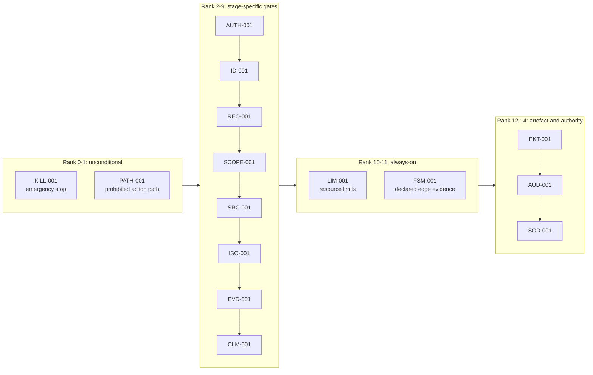

# Rule Catalog

**Document version:** 1.0.0
**Environment:** `ISOLATED_PROTOTYPE_V1`

This document is the reference description of the fifteen deterministic rules implemented in
`apps/api/app/rules/catalog.py`, their precedence, the states in which each is evaluated, and
the ordered state table they govern; it is not a policy document and does not assert that the
rule set is sufficient for any institutional purpose.

---

## 1. What a rule is here

A rule is a pure Python function of one argument: an instance of
`apps/api/app/rules/framework.py::RuleContext`. It reads nothing outside that object — no
database, no clock beyond `context.evaluated_at`, no environment variable, no model output
except the `draft` and `verification` fields the engine placed there. It returns a
`RuleOutcomeSpec` produced by one of three constructors: `passed`, `failed` or
`not_applicable`.

The engine, not the rule, stamps versioning metadata onto the outcome.
`framework.py::to_result` converts a `RuleOutcomeSpec` into a
`app/schemas/reasoning.py::DeterministicResult` carrying the rule id, rule version, case id,
input references, outcome, reason code, effect, precedence rank, evaluation timestamp and
detail. That record is persisted as a `DeterministicResultRow` and is what the packet, the
audit trail and `GET /api/v1/cases/{case_id}/progress` display. The exported schema is
`contracts/jsonschema/deterministic-result-v1.json`.

Three properties of the framework are worth stating because they are what make the catalog
verifiable rather than merely present:

- **Rules cannot be reordered by execution.** `RuleRegistry.all` sorts by
  `(precedence_rank, rule_id)`, and `RuleRegistry.for_state` filters that sorted tuple. The
  order in which rules are defined in `catalog.py` is therefore irrelevant to their
  precedence; precedence is data.
- **Evaluation does not short-circuit.** `framework.py::evaluate_state` runs every applicable
  rule for the state, appends each result to `context.results`, and returns the full list. The
  caller then selects the governing stop with `first_mandatory_stop`. This means the audit
  trail records the complete deterministic picture of a state, not just the first thing that
  went wrong.
- **A state with no applicable rule is a failure, not a fast path.**
  `app/services/orchestrator.py::CaseProcessor._evaluate` raises
  `StopError(DETERMINISTIC_GOVERNANCE_FAILURE)` when `evaluate_state` returns an empty list.
  A rule that should have evaluated but did not is likewise synthesised into a failing
  `GOV-MISSING` result rather than being silently absent — this is the mechanism the TEVV
  scenario for a missing rule exercises.

`RULE_CATALOG_VERSION` in `app/domain/versions.py` versions the catalog as a whole; each rule
additionally carries its own `rule_version`, which is `1.0.0` for all fifteen in this build
(the module-level constant `V` in `catalog.py`).

---

## 2. The fifteen rules

Precedence ranks are read directly from the `@rule(...)` decorators in `catalog.py`. They are
contiguous from 0 to 14 with no gaps and no ties.

| Rule | Version | Rank | Evaluated in | Deterministic purpose | Effect on failure | Reason code(s) on failure |
|---|---|---:|---|---|---|---|
| `KILL-001` | 1.0.0 | 0 | Stages 0–10, 16, 17 (13 states) | Stop intake, processing and review disposition while the administrator kill switch is active | `MANDATORY_STOP` | `EMERGENCY_STOP_ACTIVE` |
| `PATH-001` | 1.0.0 | 1 | Every state (all 21, including `CANNOT_PROCEED`) | Confirm no operational connector or action endpoint is configured or attempted | `MANDATORY_STOP` | `PROHIBITED_ACTION_PATH_DETECTED` |
| `AUTH-001` | 1.0.0 | 2 | Stage 0 `AUTHORIZATION_PREFLIGHT` | Validate the exact synthetic authorization fixture: currency, admitted manifest hash, admitted use-case contract, acting role in scope | `MANDATORY_STOP` | `AUTHORIZATION_NOT_CURRENT_OR_IN_SCOPE`, `MANIFEST_HASH_MISMATCH` |
| `ID-001` | 1.0.0 | 3 | Stage 1 `ACTOR_AND_SESSION_VERIFICATION` | Validate the server session, its expiry, revocation state, role and scope | `DENY_WITHOUT_DISCLOSURE` | `REQUESTER_OR_SESSION_INVALID`, `ACCESS_DENIED` |
| `REQ-001` | 1.0.0 | 4 | Stage 2 `REQUEST_NORMALIZATION` | Enforce one bounded question: non-empty, within the length bounds, no second question and no multi-question marker | `MANDATORY_STOP` | `REQUEST_CONTRACT_INVALID`, `REQUEST_LIMIT_EXCEEDED` |
| `SCOPE-001` | 1.0.0 | 5 | Stage 3 `USE_CASE_AND_RISK_SCOPE` | Block excluded action-seeking or high-impact scope terms | `MANDATORY_STOP` | `USE_CASE_EXCLUDED_OR_UNBOUNDED` |
| `SRC-001` | 1.0.0 | 6 | Stage 5 `SOURCE_ELIGIBILITY` | Validate manifest membership, file hash, plan size, and that at least one eligible source and every required authority class remain | `MANDATORY_STOP` | `MANIFEST_HASH_MISMATCH`, `SOURCE_LIMIT_EXCEEDED`, `SOURCE_ELIGIBILITY_FAILURE` |
| `ISO-001` | 1.0.0 | 7 | Stages 5 `SOURCE_ELIGIBILITY` and 6 `READ_ONLY_RETRIEVAL_AND_ISOLATION` | Treat instruction-like or security indicators as a quarantine condition; record correctly-excluded quarantined sources | `MANDATORY_STOP` | `SOURCE_QUARANTINED` |
| `EVD-001` | 1.0.0 | 8 | Stage 7 `EVIDENCE_SUFFICIENCY` | Ensure admitted evidence exists, no declared material conflict is triggered, and every required authority class is represented among admitted excerpts | `MANDATORY_STOP` | `EVIDENCE_INSUFFICIENT_OR_CONFLICTED` |
| `CLM-001` | 1.0.0 | 9 | Stage 9 `INDEPENDENT_VERIFICATION` | Enforce material claim support and the existence of exact citations; reject citations outside the admitted set and conflicted verdicts | `MANDATORY_STOP` | `MATERIAL_CLAIM_UNSUPPORTED_OR_CONFLICTED` |
| `LIM-001` | 1.0.0 | 10 | Every state (all 21) | Enforce the eleven resource limits without expanded retry | `MANDATORY_STOP` | `REQUEST_LIMIT_EXCEEDED`, `SOURCE_LIMIT_EXCEEDED`, `RETRIEVAL_LIMIT_EXCEEDED`, `EXCERPT_LIMIT_EXCEEDED`, `EXCERPT_SIZE_LIMIT_EXCEEDED`, `CONTEXT_LIMIT_EXCEEDED`, `MODEL_CALL_LIMIT_EXCEEDED`, `RETRY_LIMIT_EXCEEDED`, `MODEL_OUTPUT_LIMIT_EXCEEDED`, `CASE_WALL_CLOCK_LIMIT_EXCEEDED`, `CONCURRENCY_LIMIT_EXCEEDED` |
| `FSM-001` | 1.0.0 | 11 | Every state (all 21) | Record the deterministic evidence that the entered state was reached through a declared edge | (never fails; see below) | — |
| `PKT-001` | 1.0.0 | 12 | Stage 13 `STRUCTURAL_AND_SEMANTIC_VALIDATION` | Validate that a packet payload exists and that semantic validation reported no failure | `MANDATORY_STOP` | `PACKET_CONTRACT_FAILURE` |
| `AUD-001` | 1.0.0 | 13 | Stages 14 `PACKET_PRE_ISSUANCE_AUDIT` and 18 `DISPOSITION_CLOSURE_AUDIT` | Enforce a confirmed pre-issuance event and, at closure, a distinct confirmed closure event | `MANDATORY_STOP` | `CRITICAL_AUDIT_FAILURE` |
| `SOD-001` | 1.0.0 | 14 | Stages 16 `REVIEWER_AUTHORITY_AND_SOD` and 17 `DISPOSITION_BINDING` | Reject self-review, incompatible role, wrong scope, expired or revoked reviewers, and (at stage 17) an insufficient rationale | `DENY_WITHOUT_DISCLOSURE`, or `MANDATORY_STOP` for the rationale check | `SEPARATION_OF_DUTIES_VIOLATION`, `REVIEWER_AUTHORITY_INVALID`, `ACCESS_DENIED`, `DISPOSITION_RATIONALE_REQUIRED` |

### 2.1 Notes on individual rules

**`KILL-001` is not evaluated in every state, deliberately.** Its state set is
`PRE_HUMAN_STATES` (stages 0 to 10) plus `REVIEWER_AUTHORITY_AND_SOD` and
`DISPOSITION_BINDING`. It is therefore absent from stages 11 to 15, 18 and 19 and from
`CANNOT_PROCEED`. The reason is that the kill switch halts *new work* — intake, processing and
disposition — and does not abandon a case midway through sealing, auditing and closing an
artefact that has already been assembled. Halting at stage 14, for instance, would leave a
packet whose pre-issuance audit event was never written. Intake is additionally refused before
a case row exists, by an explicit `kill_switch_active` check in
`app/api/routes_cases.py::create_case`.

**`FSM-001` has no failing branch.** It returns `RuleOutcomeSpec.passed` unconditionally, with
the entered state as its input reference. This is not a gap: the enforcement is
`app/domain/fsm.py::assert_transition`, which is called *before* a state is entered and raises
`IllegalTransitionError` for any undeclared edge. `FSM-001` exists so that the deterministic
record for each state contains positive, versioned evidence that the state was reached through
a declared edge. Its docstring in `catalog.py` states this relationship explicitly.

**`ISO-001` distinguishes exclusion from contamination.** A quarantined source that was
correctly filtered out before retrieval produces a *pass* with the quarantined source keys
recorded as input references and an explanatory detail. Only instruction-like content that
reached the admitted excerpt set produces a `SOURCE_QUARANTINED` stop. The pass-with-reference
path is what makes the exclusion visible in the packet's uncertainty and risk sections rather
than silently discarded.

**`ID-001` and most of `SOD-001` use `DENY_WITHOUT_DISCLOSURE`, not `MANDATORY_STOP`.** The
effect is a member of `app/domain/enums.py::RuleEffect`, and `DeterministicResult.is_mandatory_stop`
treats both as governing stops — the difference is what the caller may reveal.
`app/services/review.py::submit_disposition` raises `AccessDeniedError` (HTTP 403) for a
stage-16 denial and `StopError` (HTTP 422) for a stage-17 stop, and in neither case does the
envelope name which of the several checks failed. The rationale check inside `SOD-001` is the
one branch that uses the default `MANDATORY_STOP`, because "your rationale is too short" is
safe to tell the reviewer and actionable by them.

**`SOD-001` checks self-review first.** The ordering is deliberate and commented in the code:
self-review holds regardless of the role an identity carries, so reporting the weaker
"wrong role" denial for a requester reviewing its own case would name the less specific of two
true violations.

**`AUTH-001` can produce `MANIFEST_HASH_MISMATCH`, which is not the stage's own failure code.**
The stage failure code for `AUTHORIZATION_PREFLIGHT` is
`AUTHORIZATION_NOT_CURRENT_OR_IN_SCOPE`. When the specific cause is that the corpus manifest
hash is not the one the authorization fixture admits, the rule returns the more precise
`MANIFEST_HASH_MISMATCH`. `app/services/orchestrator.py::CaseProcessor` propagates the rule's
reason code rather than overwriting it with the state default, so the more specific code is
what the case, the stop record and the error envelope carry.

---

## 3. Precedence semantics

**A lower rank outranks a higher one.** `KILL-001` at rank 0 and `PATH-001` at rank 1 are
therefore the top two: neither the emergency stop nor the prohibited-path check can be
outvoted by any downstream result, however confident a model was or however many other rules
passed.

Precedence is applied in exactly two places, and nowhere else:

| Function | Role of precedence |
|---|---|
| `framework.py::RuleRegistry.all` | Sorts the catalog by `(precedence_rank, rule_id)`. `for_state` filters this sorted tuple, so applicable rules always evaluate in precedence order. |
| `framework.py::first_mandatory_stop` | Filters the results for `is_mandatory_stop`, sorts the survivors by `(precedence_rank, rule_id)` and returns the first. |

The secondary sort on `rule_id` matters only as a tie-break guarantee. Since the fifteen ranks
in this catalog are unique, it never actually decides an outcome in this build; it is present
so that the ordering remains total if a future rule were added at an existing rank.

Two consequences follow from this design, and both are load-bearing:

- **Evaluation order does not determine the outcome.** Because `evaluate_state` runs all
  applicable rules and the caller selects afterwards, a rule cannot suppress a
  higher-precedence rule by failing first. If both `KILL-001` and `SRC-001` fail in
  `SOURCE_ELIGIBILITY`, both results are persisted and audited, and the case stops with
  `EMERGENCY_STOP_ACTIVE` because rank 0 beats rank 6.
- **Model output cannot enter the comparison.** The only model-derived values in
  `RuleContext` are `draft`, `verification` and the `material_claim_failures` tuple that the
  orchestrator computed by re-slicing quotes. There is no field through which a model could
  supply a rank, an effect, an outcome or a waiver. This is INV-06, and
  `test_contracts.py::TestClosedSchemas::test_draft_cannot_carry_a_route_or_authority_field`
  asserts the schema side of it.

### 3.1 Rules that apply everywhere

Three rules — `PATH-001`, `LIM-001`, `FSM-001` — are registered against `ALL_STATES`, which is
`tuple(CaseState)` and therefore includes `CANNOT_PROCEED`. This is why every state has at
least three applicable rules and the empty-evaluation failure path in `_evaluate` is a genuine
safety net rather than a reachable condition in normal operation.



The diagram shows precedence, not execution: within any single state, only the applicable
subset runs, and all of it runs.

---

## 4. Dominant-factor risk

Risk is computed by `apps/api/app/services/packet.py::build_risk_profile`, whose docstring
states the method in one line: *dominant-factor risk; a `CRITICAL` or `UNKNOWN` factor can
never be averaged down*.

The function builds exactly four factors, every time, from deterministic inputs only:

| Factor id | Label | Level assignment | Input |
|---|---|---|---|
| `RF-EVIDENCE` | Evidence sufficiency | `LOW` if at least one material claim carries an exact citation, otherwise `UNKNOWN` | `material_claim_count` |
| `RF-CONFLICT` | Source conflict | `CRITICAL` if any declared material conflict applies, otherwise `LOW` | `conflicts` |
| `RF-UNCERTAINTY` | Residual uncertainty | `MODERATE` if any uncertainty record is attached, otherwise `LOW` | `uncertainty` |
| `RF-ISOLATION` | Content isolation | `MODERATE` if any quarantined source was excluded, otherwise `LOW` | `quarantined_sources` |

The dominant factor is then selected by

```python
dominant = max(factors, key=lambda factor: RISK_ORDER[factor.level])
```

with `RISK_ORDER` from `app/domain/enums.py`:

| Level | Order value |
|---|---:|
| `LOW` | 0 |
| `MODERATE` | 1 |
| `HIGH` | 2 |
| `UNKNOWN` | 3 |
| `CRITICAL` | 4 |

`RiskProfile.inherent_risk` is set to the dominant factor's level, and
`dominant_factor_id` names which factor decided it.

### 4.1 Why maximum rather than mean

The choice of `max` over any averaging or weighting scheme is the substance of the method, so
it is worth being explicit about what it buys.

Under an averaging scheme, three `LOW` factors and one `CRITICAL` factor would produce a
middling aggregate, and a reviewer would see a moderate-looking number that conceals a
disqualifying condition. Under `max`, a single `CRITICAL` factor makes the profile `CRITICAL`
regardless of how favourable everything else is. A declared material conflict between active
sources — the `RF-CONFLICT` trigger — is exactly such a condition: it means the corpus itself
disagrees about the answer, and no amount of clean citation elsewhere makes that safe to
present as low risk.

The placement of `UNKNOWN` at order 3, above `HIGH` and below `CRITICAL`, is the second half
of the same argument. "We do not know" is not a mild finding. `RF-EVIDENCE` returns `UNKNOWN`
precisely when no material claim carries a citation, which is the case where the system has
least basis for any statement at all. Ranking `UNKNOWN` below `MODERATE` — as a naive
"unknown means no signal" reading would — would let the least-evidenced packets present as
the safest.

### 4.2 What the risk level then controls

Two derived fields are set from the dominant level, and they are the reason the risk profile
is more than a label:

| Field | Value |
|---|---|
| `reviewer_seniority_required` | "Manager grade or above with restricted records authorisation" when the dominant level is `CRITICAL` or `HIGH`; otherwise "Manager grade or above" |
| `review_depth_required` | "Full evidence re-read with written escalation" when the dominant level is `CRITICAL`, `HIGH` or `UNKNOWN`; otherwise "Standard citation and rule-result review" |

Note that `UNKNOWN` escalates the required review *depth* but not the required *seniority*.
That asymmetry is what the code does. It is consistent with the reading above: missing
evidence demands more thorough reading, whereas a critical or high finding additionally
demands a more senior reader.

Independently of the risk profile, `app/services/packet.py::validate_packet_semantics` reports
`SEM-07_CRITICAL_RISK_WITHOUT_STOP` if a packet routed to `HUMAN_REVIEW_REQUIRED` carries
`inherent_risk == CRITICAL`. A critical dominant factor and a review route therefore cannot
coexist in a displayable packet: the packet fails validation at stage 13 and the case stops
with `PACKET_CONTRACT_FAILURE`. This is stronger than Section 12.1 check 7 of the controlling
specification, which requires only that a stop route carry a reason code.

### 4.3 Where the inputs come from

None of the four factor inputs is model-derived:

| Input | Produced by |
|---|---|
| `material_claim_count` | `app/services/orchestrator.py::CaseProcessor._bind_claims`, counting claims whose quoted spans re-sliced successfully from the stored excerpt |
| `conflicts` | `data/synthetic_policy_collection_v1/conflicts.json` matched against the admitted source set |
| `uncertainty` | `CaseProcessor._record_uncertainty`, from triggered conflicts and quarantine exclusions |
| `quarantined_sources` | `app/services/eligibility.py::evaluate_source_eligibility` |

A model can influence `material_claim_count` only by drafting claims whose quotes actually
reproduce from the corpus at the recorded offsets. It cannot raise the count by asserting
support, because `_bind_claims` downgrades `SUPPORTED` to `UNSUPPORTED` whenever a quote fails
to re-slice.

---

## 5. The ordered state table

States are defined in `app/domain/enums.py::CaseState`, staged by `CASE_STATE_STAGE`, ordered
by `ORDERED_CASE_STATES`. Failure reason codes are resolved by
`app/domain/fsm.py::failure_reason_for`, which reads `STATE_FAILURE_REASON` from
`app/domain/reason_codes.py` and defaults to `DETERMINISTIC_GOVERNANCE_FAILURE`.

| Stage | State | Pass condition as implemented | Applicable rules | Failure reason code |
|---:|---|---|---|---|
| 0 | `AUTHORIZATION_PREFLIGHT` | `AUTH-001` accepts the fixture: current, admitted manifest hash, admitted contract, acting role in the authorized set | `KILL-001`, `PATH-001`, `AUTH-001`, `LIM-001`, `FSM-001` | `AUTHORIZATION_NOT_CURRENT_OR_IN_SCOPE` |
| 1 | `ACTOR_AND_SESSION_VERIFICATION` | `ID-001` accepts identity status, validity window and scope match | `KILL-001`, `PATH-001`, `ID-001`, `LIM-001`, `FSM-001` | `REQUESTER_OR_SESSION_INVALID` |
| 2 | `REQUEST_NORMALIZATION` | `REQ-001` accepts one bounded question within length bounds with no multi-question marker | `KILL-001`, `PATH-001`, `REQ-001`, `LIM-001`, `FSM-001` | `REQUEST_CONTRACT_INVALID` |
| 3 | `USE_CASE_AND_RISK_SCOPE` | `SCOPE-001` finds no excluded scope term in the normalised question | `KILL-001`, `PATH-001`, `SCOPE-001`, `LIM-001`, `FSM-001` | `USE_CASE_EXCLUDED_OR_UNBOUNDED` |
| 4 | `EVIDENCE_PLAN` | `evaluate_source_eligibility` yields at least one eligible source; the plan is capped at `SOURCE_PLAN_MAX` (6) | `KILL-001`, `PATH-001`, `LIM-001`, `FSM-001` | `EVIDENCE_REQUIREMENT_UNRESOLVED` |
| 5 | `SOURCE_ELIGIBILITY` | `SRC-001` finds no hash mismatch, at least one eligible source and every required authority class present; `ISO-001` records quarantine exclusions | `KILL-001`, `PATH-001`, `SRC-001`, `ISO-001`, `LIM-001`, `FSM-001` | `SOURCE_ELIGIBILITY_FAILURE` |
| 6 | `READ_ONLY_RETRIEVAL_AND_ISOLATION` | `retrieve` returns at least one excerpt and `ISO-001` finds no instruction-like flag in the admitted set | `KILL-001`, `PATH-001`, `ISO-001`, `LIM-001`, `FSM-001` | `RETRIEVAL_OR_ISOLATION_FAILURE` |
| 7 | `EVIDENCE_SUFFICIENCY` | `EVD-001` finds excerpts present, no triggered declared conflict, and every required authority class represented among admitted excerpts | `KILL-001`, `PATH-001`, `EVD-001`, `LIM-001`, `FSM-001` | `EVIDENCE_INSUFFICIENT_OR_CONFLICTED` |
| 8 | `BOUNDED_DRAFT` | The single draft call returns schema-valid JSON citing only admitted excerpt ids, within the output ceiling and timeout | `KILL-001`, `PATH-001`, `LIM-001`, `FSM-001` | `MODEL_BOUNDARY_OR_SCHEMA_FAILURE` |
| 9 | `INDEPENDENT_VERIFICATION` | The single verifier call returns one verdict per drafted claim; `_bind_claims` re-slices every quote; `CLM-001` finds no unsupported material claim, no citation outside the admitted set and no conflicted claim | `KILL-001`, `PATH-001`, `CLM-001`, `LIM-001`, `FSM-001` | `MATERIAL_CLAIM_UNSUPPORTED_OR_CONFLICTED` |
| 10 | `DETERMINISTIC_GOVERNANCE` | No applicable rule returned a mandatory stop, and no earlier recorded result is a mandatory stop | `KILL-001`, `PATH-001`, `LIM-001`, `FSM-001` | `DETERMINISTIC_GOVERNANCE_FAILURE` |
| 11 | `ROUTE_DETERMINATION` | The route is `HUMAN_REVIEW_REQUIRED`; it is assigned in code, never selected | `PATH-001`, `LIM-001`, `FSM-001` | `ROUTE_INVARIANT_FAILURE` |
| 12 | `PACKET_ASSEMBLY` | `build_packet` assembles and `seal` canonically hashes the packet | `PATH-001`, `LIM-001`, `FSM-001` | `PACKET_ASSEMBLY_FAILURE` |
| 13 | `STRUCTURAL_AND_SEMANTIC_VALIDATION` | `validate_packet_semantics` returns an empty failure tuple and `PKT-001` passes | `PATH-001`, `LIM-001`, `FSM-001`, `PKT-001` | `PACKET_CONTRACT_FAILURE` |
| 14 | `PACKET_PRE_ISSUANCE_AUDIT` | `record_and_confirm` durably commits and re-reads the `PACKET_PRE_ISSUANCE` event, and `AUD-001` sees its id | `PATH-001`, `LIM-001`, `FSM-001`, `AUD-001` | `CRITICAL_AUDIT_FAILURE` |
| 15 | `AWAITING_AUTHORIZED_HUMAN_REVIEW` | The packet is persisted `displayable=True`; automated processing ends here | `PATH-001`, `LIM-001`, `FSM-001` | `DETERMINISTIC_GOVERNANCE_FAILURE` (default; see 5.1) |
| 16 | `REVIEWER_AUTHORITY_AND_SOD` | `SOD-001` accepts a reverified, active, correctly-roled, in-scope reviewer who is not the requester | `KILL-001`, `PATH-001`, `LIM-001`, `FSM-001`, `SOD-001` | `DETERMINISTIC_GOVERNANCE_FAILURE` (default; the rule's own code is reported) |
| 17 | `DISPOSITION_BINDING` | `SOD-001` passes again, a rationale of at least `RATIONALE_MIN_CHARS` (20) is present, any supplied `packet_sha256` equals the issued hash, and no final disposition already exists for this packet version | `KILL-001`, `PATH-001`, `LIM-001`, `FSM-001`, `SOD-001` | `DETERMINISTIC_GOVERNANCE_FAILURE` (default; the rule's own code is reported) |
| 18 | `DISPOSITION_CLOSURE_AUDIT` | `record_and_confirm` commits a `DISPOSITION_CLOSURE` event, and `AUD-001` confirms it is distinct from pre-issuance | `PATH-001`, `LIM-001`, `FSM-001`, `AUD-001` | `DETERMINISTIC_GOVERNANCE_FAILURE` (default; `CRITICAL_AUDIT_FAILURE` is reported) |
| 19 | `CLOSED_DECISION_SUPPORT_RECORD` | Reached only for a final disposition. Terminal, no outbound edge | `PATH-001`, `LIM-001`, `FSM-001` | `DETERMINISTIC_GOVERNANCE_FAILURE` (default; unreachable) |
| — | `CANNOT_PROCEED` | Terminal stop state. No stage number; no outbound edge | `PATH-001`, `LIM-001`, `FSM-001` | — |

### 5.1 Accuracy note on stages 15 to 19

`STATE_FAILURE_REASON` in `app/domain/reason_codes.py` maps stages 0 to 14 only, and
`failure_reason_for` returns `DETERMINISTIC_GOVERNANCE_FAILURE` for anything absent from that
map. The table above records that default truthfully, but it would be misleading to leave the
impression that a stage-16 denial surfaces as `DETERMINISTIC_GOVERNANCE_FAILURE`. It does not.

Failures in the review stages are reported through the specific reason code of the rule that
produced them, because `app/services/review.py::submit_disposition` reads
`ReasonCode(stop.reason_code)` from the governing `DeterministicResult` and raises with that
code. A reviewer attempting self-review therefore receives `SEPARATION_OF_DUTIES_VIOLATION`;
a reviewer with a short rationale receives `DISPOSITION_RATIONALE_REQUIRED`; a stale packet
hash yields `PACKET_NOT_AVAILABLE`; a closure that cannot be confirmed yields
`CRITICAL_AUDIT_FAILURE`. The state-map default is the fallback for a state whose failure has
no rule-specific code, and in the review stages it is never the value actually reported.

Stage 15 has no failure code in practice because it is a waiting state, not a check. Section
11.2 of the controlling specification says "wait/expire as configured" for this stage; no
expiry timer is implemented, so a case waits indefinitely. This is recorded as a declared but
unexercised boundary in `docs/architecture.md` section 8.7.

### 5.2 Declared transitions

`app/domain/fsm.py::DECLARED_TRANSITIONS` is a frozen set of **41 edges**:

| Group | Count | Description |
|---|---:|---|
| Sequential | 19 | Stage *n* to stage *n+1*, for stages 0 to 18 |
| Stop | 19 | Each state in `STOPPABLE_STATES` to `CANNOT_PROCEED`. That set is every ordered state except `CLOSED_DECISION_SUPPORT_RECORD` |
| Return to waiting | 3 | From stages 16, 17 and 18 back to `AWAITING_AUTHORIZED_HUMAN_REVIEW` |

`assert_transition` rejects everything else, and additionally rejects any edge whose
`from_state` is in `TERMINAL_CASE_STATES` — that is, `CANNOT_PROCEED` and
`CLOSED_DECISION_SUPPORT_RECORD` — so a terminal case cannot be revived even along an edge
that would otherwise be declared. Skips, reorders, self-loops and replays all resolve to
`IllegalTransitionError` with `ILLEGAL_STATE_TRANSITION` at HTTP 409 and severity
`S0_CRITICAL`.

The three return edges are what make a failed review non-destructive: a denied or unbindable
disposition returns the case to stage 15 with the packet still displayable, rather than
stopping the case. A `RETURN_FOR_CLARIFICATION` disposition uses the third return edge, from
stage 18, having been fully recorded, audited and resealed into the packet.

---

## 6. Where to read the catalog at runtime

| Surface | What it shows |
|---|---|
| `GET /api/v1/admin/configuration` | `rule_catalog` from `app/rules/catalog.py::catalog_payload` — rule id, rule version, catalog version, precedence rank, purpose, and the sorted list of states each rule is evaluated in; plus `state_machine` from `app/domain/fsm.py::transition_table` |
| `GET /api/v1/cases/{case_id}/progress` | Per-case `rule_results`: rule id, rule version, outcome, reason code, effect, precedence rank, detail, evaluation time |
| `GET /api/v1/cases/{case_id}/lineage` | `RULE` nodes and the `DETERMINES` edges from rules to the route |
| The Decision Readiness Packet | The full deterministic result ledger, inside the sealed canonical artefact |

---

## 7. Related documents

| Document | Covers |
|---|---|
| `docs/architecture.md` | Where each invariant is enforced; the request lifecycle that drives these evaluations |
| `docs/api-contract.md` | Which reason codes each endpoint can return, and the single error envelope |
| `docs/source-governance.md` | The eligibility inputs `SRC-001`, `ISO-001` and `EVD-001` read |
| `docs/model-configuration-card.md` | The limits `LIM-001` enforces on the model path |
| `docs/threat-model.md` | The threats each rule contains, and the tests that prove it |
| `docs/tevv-plan.md` | The frozen scenarios that exercise each rule |

---

| Dimension | Value |
|---|---|
| Built | `NOT_EVIDENCED` |
| Integration | `NOT_EVIDENCED` |
| Operational | `NOT_EVIDENCED` |
| Authorization | `NOT_GRANTED` |
